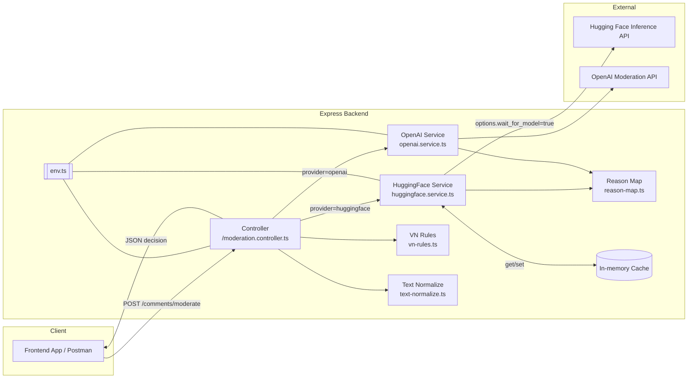

# AI Moderation Express (Backend)

Một dịch vụ API kiểm duyệt nội dung (comment/text moderation) xây dựng bằng **Express + TypeScript + Bun**, hỗ trợ **Hugging Face** và **OpenAI**.  
Dự án được thiết kế để dễ mở rộng, tối ưu cho tiếng Việt với bộ luật `VN_RULES`.

## 🚀 Tính năng chính
- Gọi **Hugging Face Inference API** hoặc **OpenAI Moderation API** để phân loại nội dung.
- Hỗ trợ **đa ngôn ngữ**, tối ưu cho **tiếng Việt** bằng:
  - Chuẩn hoá Unicode + bỏ dấu.
  - Chuyển đổi leetspeak (vd: `l0n` → `lon`).
  - Lớp luật `VN_RULES` để bắt từ khóa tục/insult phổ biến.
- Cho phép cấu hình ngưỡng (`HF_THRESHOLD`) và fallback top-1.
- Bộ nhớ đệm (cache) kết quả để giảm số lần gọi API.
- Debug mode để xem dữ liệu thô từ model.
- API RESTful đơn giản, dễ tích hợp với frontend.

---

## 📂 Cấu trúc thư mục
```

src/
config/env.ts                # Load và parse biến môi trường
server.ts                    # Khởi chạy Express server
routes/moderation.routes.ts  # Định nghĩa route /comments/moderate
controllers/                 # Xử lý request/response
services/
moderation/
huggingface.service.ts   # Gọi HF API + fine-tune BE
openai.service.ts        # Gọi OpenAI API
reason-map.ts            # Map label → taxonomy chung
vn-rules.ts              # Luật từ khóa tiếng Việt
text-normalize.ts          # Hàm chuẩn hoá văn bản
types/                       # TypeScript types & type guards
.env.example                   # Mẫu cấu hình môi trường

````

---

## ⚙️ Cài đặt

### 1. Clone repo
```bash
git clone https://github.com/your-username/ai-moderation-express.git
cd ai-moderation-express
````

### 2. Cài dependencies

```bash
bun install
```

### 3. Tạo file `.env`

Dựa trên `.env.example`:

```env
PORT=3000

# Provider: huggingface hoặc openai
PROVIDER=huggingface

# Hugging Face
HF_API_KEY=hf_xxx
HF_MODEL=unitary/toxic-bert
HF_THRESHOLD=0.5
HF_TOP1_FALLBACK=0.7

# Luật tiếng Việt
VN_RULES_ENABLED=true
VN_RULES_STRICT=false

# Cache (ms)
CACHE_TTL_MS=60000

# Debug mode
PROVIDER_DEBUG=true

# OpenAI (nếu dùng)
# OPENAI_API_KEY=sk-...
```

---

## ▶️ Chạy server

### Dev mode (hot reload)

```bash
bun dev
```

### Production

```bash
bun start
```

Mặc định API sẽ chạy ở:
`http://localhost:3000`

---

## Tổng quan hệ thống (kiến trúc)



## 📡 API Endpoints

### **POST** `/comments/moderate`

Kiểm duyệt một đoạn văn bản.

#### Request body

```json
{
  "text": "thằng ngu"
}
```

```json
{
  "allowed": false,
  "reasons": ["harassment"],
  "debug": {
    "model": "unitary/toxic-bert",
    "threshold": 0.5,
    "raw": [...]
  }
}
```

* `allowed`: `true` nếu văn bản được chấp nhận, `false` nếu bị chặn.
* `reasons`: Lý do bị chặn (taxonomy chung).
* `debug`: Thông tin chi tiết (bật qua `PROVIDER_DEBUG=true`).

---

#### Request – Response

```mermaid
sequenceDiagram
  autonumber
  participant FE as Frontend / Client
  participant API as Express Controller
  participant TN as Text Normalize
  participant HF as HF Service
  participant VN as VN Rules
  participant RM as Reason Map
  participant HFI as HF Inference API
  participant C as Cache

  FE->>API: POST /comments/moderate { text }
  API->>TN: normalizeForModeration(text)
  TN-->>API: normalizedText
  API->>HF: moderateWithHF(normalizedText)
  HF->>C: check cache
  alt cache hit
    C-->>HF: decision
    HF-->>API: decision
  else cache miss
    HF->>HFI: {inputs, options:{wait_for_model:true}}
    HFI-->>HF: raw scores (labels, scores[])
    HF->>RM: normalizeHFLabels(labels)
    RM-->>HF: reasons[]
    HF-->>API: { allowed, reasons, debug? }
    HF->>C: set cache(decision)
  end
  API->>VN: violatesVietnameseRules(originalText)
  alt VN rule matched
    VN-->>API: true
    API->>API: reasons.push('harassment')
  else
    VN-->>API: false
  end
  API-->>FE: { allowed, reasons, debug? }
````

---

## 🛠 Fine-tune logic ở BE

* **Chuẩn hoá text** trước khi gửi model (`normalizeForModeration`).
* **VN\_RULES** override kết quả model nếu phát hiện từ khóa vi phạm tiếng Việt.
* **Ngưỡng linh hoạt**: Fallback lấy top-1 nếu vượt một tỉ lệ so với threshold (`HF_TOP1_FALLBACK`).
* **Cache** giúp giảm số lần gọi API với text trùng lặp.

---

## 🔄 Chuyển đổi giữa Hugging Face & OpenAI

Chỉ cần đổi biến môi trường `PROVIDER`:

```env
PROVIDER=openai
OPENAI_API_KEY=sk-...
```

> Code sẽ tự động chọn service tương ứng.

---

## 🧪 Test nhanh với cURL

```bash
curl -X POST http://localhost:3000/comments/moderate \
  -H "Content-Type: application/json" \
  -d '{"text":"thằng chó ngu"}'
```

## 👨‍💻 Tác giả - Nguyễn Huỳnh Sang

Pet project phục vụ mục đích học tập và tích hợp AI vào hệ thống kiểm duyệt nội dung.

