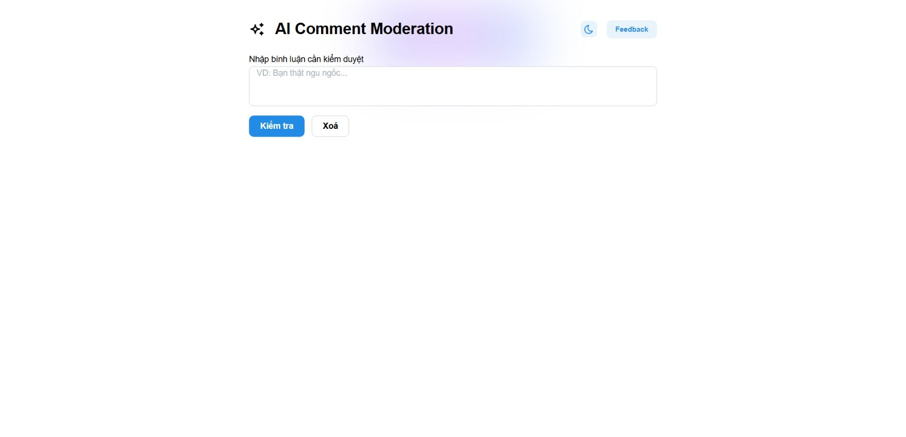
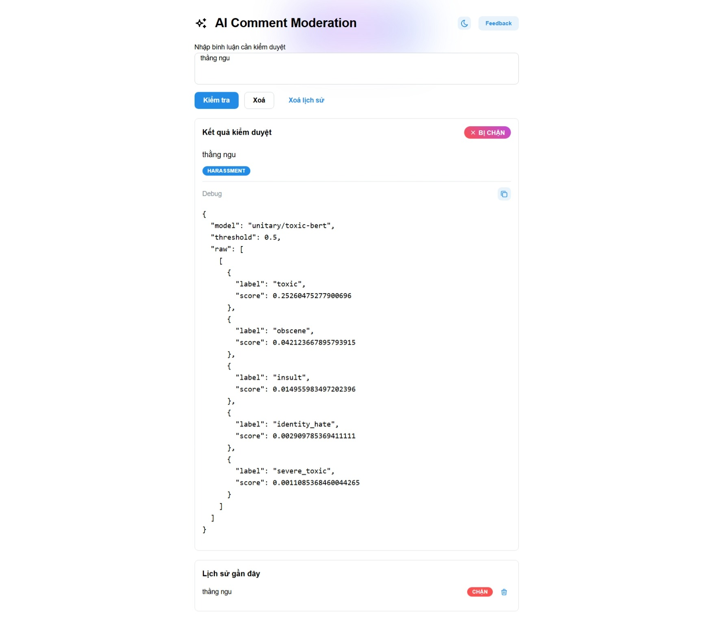

# AI Moderation — Frontend (React + Vite + TS)

Ứng dụng web nhỏ để kiểm duyệt bình luận theo thời gian thực, kết nối với Backend qua API `/comments/moderate`. Dự án dùng **Vite + React + TypeScript**, UI bằng **Mantine**, state server bằng **@tanstack/react-query**, có thông báo (notifications) và highlight từ ngữ vi phạm.

## 🧱 Tech stack

* **React 18 + Vite 5 + TypeScript** (HMR, nhanh gọn)
* **Mantine v8** (UI components, theme dark/light, notifications)
* **@tanstack/react-query v5** (mutation/fetch kết quả kiểm duyệt)
* **Axios/Fetch**, **Lottie**, **framer-motion**, **canvas-confetti** (hiệu ứng/animation)

## ✨ Tính năng chính (FE)

* Nhập bình luận và gửi kiểm duyệt → hiển thị **Allowed/Blocked** rõ ràng, badge & animation confetti khi được duyệt.
* **Highlight** từ/đoạn vi phạm dựa vào token Backend trả về (`offending`, `debug.badwordsMatched`) – nếu không có, fallback theo từ khóa mẫu theo từng `reason`.
* **Lịch sử** 10 lần kiểm duyệt gần nhất + xoá từng mục hoặc xoá tất cả.
* **Theme Toggle** Dark/Light.
* **Notifications** báo kết quả/thất bại khi gọi API.
* **Skeleton** cho trạng thái loading (Result + History).

## 🖼️ UI Preview (placeholder)

1. **Home / Form nhập & kết quả**  
   <div>
    
   </div>

2. **Trạng thái Bị chặn + highlight**  
   <div>
    
   </div>
   
## 📦 Cấu trúc thư mục

```
src/
  App.tsx
  main.tsx
  components/
    HeaderBar.tsx
    TextModerationForm.tsx
    ModerationResult.tsx
    HistoryList.tsx
    HistorySkeleton.tsx
    ResultSkeleton.tsx
    ThemeToggle.tsx
    ConfettiBurst.tsx
    SuccessLottie.tsx
  libs/
    api.ts
    highlight.tsx
```

(Tham khảo danh sách file đầy đủ trong repo)

## ⚙️ Cấu hình & biến môi trường

* **API base URL**: đặt tại `VITE_API_BASE` (mặc định `http://localhost:3000`).

Tạo file `.env` (hoặc `.env.local`):

```env
VITE_API_BASE=http://localhost:3000
```

## ▶️ Chạy dự án

Yêu cầu Node.js LTS. Dùng npm/pnpm/yarn đều được (ví dụ với npm):

```bash
# Cài deps
npm i

# Dev (HMR)
npm run dev

# Build production
npm run build

# Preview build
npm run preview
```

Các script tương ứng trong `package.json`: `dev`, `build`, `lint`, `preview`.

## 🔌 Tích hợp Backend

* FE gọi `POST {VITE_API_BASE}/comments/moderate` với payload `{ text }`.
* Kiểu dữ liệu response (đơn giản hoá):

```ts
type ModerationResp = {
  allowed: boolean;
  reasons: string[];
  offending?: string[];
  debug?: {
    model?: string;
    threshold?: number;
    raw?: unknown;
    offending?: string[];
    badwordsMatched?: string[];
  };
};
```

(Định nghĩa thực tế trong `src/libs/api.ts`).

> FE dùng **React Query `useMutation`** để gọi API, hiển thị skeleton khi pending, thông báo khi thành công/thất bại, và đẩy vào lịch sử 10 mục gần nhất.

## 🧭 Luồng hoạt động (FE)

1. Người dùng nhập bình luận tại `TextModerationForm` → submit
2. `App` gọi `moderateText(text)` → fetch tới BE
3. Nhận `ModerationResp` →

   * Hiển thị **ModerationResult** (badge, lottie, highlight)
   * Lưu **HistoryList** + thao tác xoá từng mục

## 🎨 UI/UX notes

* **MantineProvider** + theme riêng (Inter, defaultRadius) trong `main.tsx`.
* **ThemeToggle** dựa trên `useComputedColorScheme` và `useMantineColorScheme`.
* **HeaderBar** có hiệu ứng glow nhẹ, nút Feedback (tuỳ bạn gắn handler).

## 🧪 Kiểm thử nhanh

* Nhập câu “hiền lành, lịch sự” → thường **ĐƯỢC DUYỆT**, confetti hoạt động.
* Nhập câu có từ khoá tục/insult → thường **BỊ CHẶN**, highlight các từ bị đánh dấu (nếu BE trả token hoặc dùng fallback).

## 🧹 Lint & chất lượng

* ESLint cấu hình sẵn (TS + react-hooks + react-refresh) → `npm run lint`.

## 🚀 Build & Deploy

1. `npm run build` tạo `dist/` (SPA).
2. Triển khai tĩnh (Vercel/Netlify/Nginx) – nhớ cấu hình **CORS** ở Backend (nếu FE và BE khác domain).
3. Đặt `VITE_API_BASE` phù hợp môi trường production.

## 👨‍💻 Tác giả - Nguyễn Huỳnh Sang 
Pet project phục vụ mục đích học tập và tích hợp AI vào hệ thống kiểm duyệt nội dung.

---
