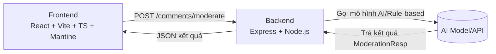
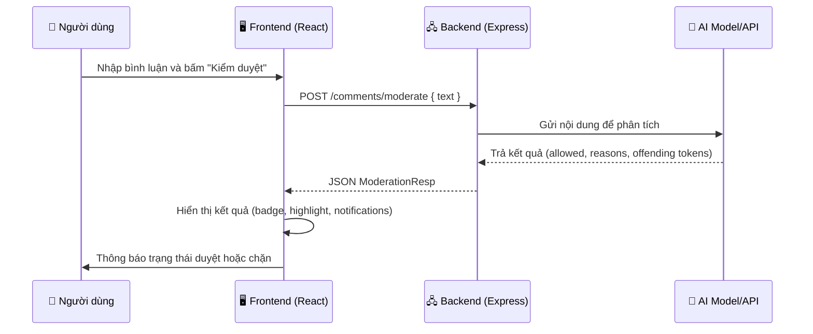

<p align="center"> 
  
  &nbsp;
  
  &nbsp;
  
  &nbsp;
  
  &nbsp;
</p
# 🛡️ AI Moderation — Pet Project

Hệ thống kiểm duyệt nội dung bình luận **theo thời gian thực**, gồm **Backend** và **Frontend**.
Ứng dụng mô phỏng việc phát hiện và chặn các bình luận vi phạm (ngôn từ tục tĩu, xúc phạm, đe dọa, v.v.) bằng cách phân tích và đánh giá nội dung.

---

## 📜 Giới thiệu

Dự án gồm 2 phần:

- **[Backend (Express + Node.js)](./BE/README.md)**: Nhận bình luận, kiểm duyệt qua mô hình AI (hoặc rule-based), trả kết quả và token các từ vi phạm.
- **[Frontend (React + Vite + TS + Mantine)](./FE/README.md)**: Giao diện web cho người dùng nhập bình luận, xem kết quả kiểm duyệt, highlight từ vi phạm, lưu lịch sử.

Mục tiêu: tạo một pipeline kiểm duyệt cơ bản nhưng trực quan, dễ mở rộng, phù hợp để học tập và thử nghiệm AI moderation.

---

## ✨ Tính năng chính

- **Kiểm duyệt bình luận** thời gian thực.
- **Highlight** từ/đoạn vi phạm trong bình luận.
- **Lưu lịch sử** 10 lần kiểm duyệt gần nhất.
- **Dark/Light mode** và thông báo trạng thái.
- **BE API** đơn giản, dễ tích hợp với hệ thống khác.

---

## 🏗️ Kiến trúc tổng quan



---

## 🔄 Luồng xử lý request chi tiết



---

## 🧱 Stack sử dụng

### Backend

- **Node.js + Express** — server REST API đơn giản.
- **Zod** — validate dữ liệu.
- **AI/Rule-based** — kiểm duyệt nội dung.

### Frontend

- **React 18 + Vite + TypeScript** — SPA nhanh, tối ưu.
- **Mantine UI** — giao diện hiện đại, dễ tùy biến.
- **@tanstack/react-query** — quản lý state server.
- **Axios** — gọi API.

---

## 📂 Cấu trúc repo

```
root/
  ├── BE/             # Backend (Express + Node.js)
  │    └── README.md  # Docs chi tiết BE
  ├── FE/             # Frontend (React + Vite + TS)
  │    └── README.md  # Docs chi tiết FE
  └── README.md       # Giới thiệu chung (file này)
```

---

## ⚙️ Cài đặt & chạy

### 1️⃣ Clone repo

```bash
git clone https://github.com/<your-username>/ai-moderation.git
cd ai-moderation
```

### 2️⃣ Cài Backend

```bash
cd BE
npm install
npm run dev
```

> BE mặc định chạy tại `http://localhost:3000`.

### 3️⃣ Cài Frontend

```bash
cd ../FE
npm install
npm run dev
```

> FE mặc định chạy tại `http://localhost:5173`.

---

## 🖼️ Minh họa UI (placeholder)

1. **Form nhập bình luận & kết quả**

   ```
   
   ```

2. **Highlight từ vi phạm**

   ```
   
   ```

---

## 🚀 Hướng phát triển

- Thêm xác thực (Auth) để quản lý user.
- Tích hợp WebSocket để kiểm duyệt theo luồng chat.
- Tùy chọn nhiều mô hình AI khác nhau.
- Dashboard thống kê tỉ lệ duyệt/chặn.

---
